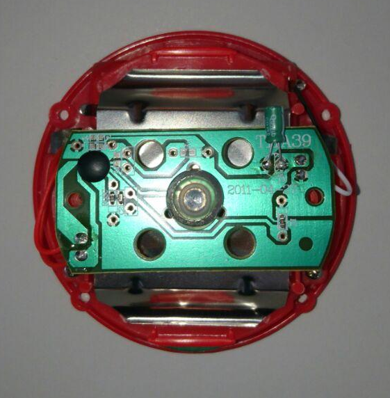
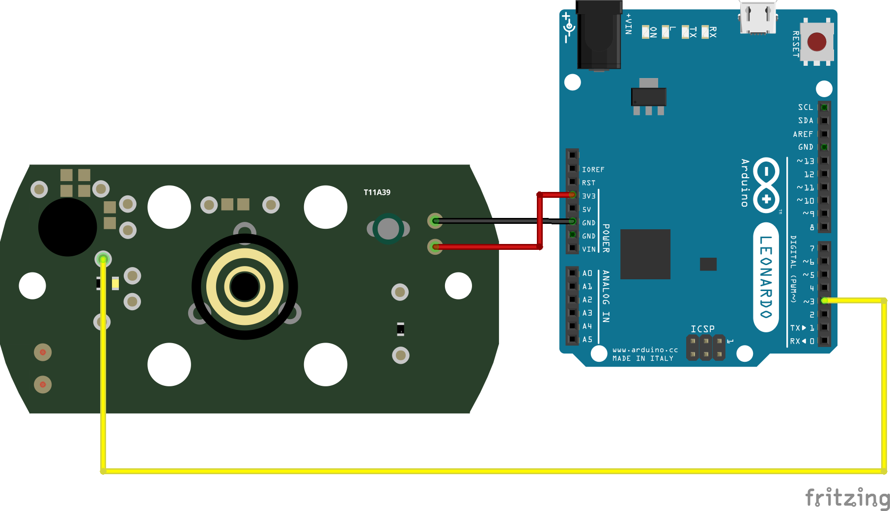

# Welcome to my Easy Button Project

Welcome reader! There are little to no words that describe the gratitude I give for the fact that at least someone is taking his time to view this silly project I have been working on.

- [Introduction](#introduction)
- [Observation](#observation)
- [Hacking](#hacking)

## Introduction

Many may ask what exactly has inspired me to invest my precious and important time on this *very serious* world changing innovation.

The answer is simple:

---

_**Boredom**_  

---

But it wasn't only boredom that lead to this project.

It began with a friends visit to the United States. The easy button is by far no unknown piece of tech, although it may seem like one if it wasn't for it's popularity among Internet celebrities. My friend, like many others, was one of the unfortunate marketing victims that have decided to purchase this utterly useless, but highly tempting, button.

Lets look at this button from a consumers perspective:

- It's big
- It's red
- It plays a "That was easy!" dialog upon press

These factors make it an ideal product for small kids and edgy adults that have the fortunate luck to use this button during their job, without getting fired on the place.

But of course there's always someone that simply can't play by rules. And if you haven't guessed by now, in this case that someone was me ;)

*But it's just a button* you might say. And you're absolutely right, but that doesn't stop me, and most importantly my curiosity to tinker with this useless pop culture product to turn it into something slightly *less useless*.

Four years have passed... My friends button was stowed away, forgotten in the darkest corner of his room. It was only then, when he mentioned the button in a conversation of ours, that the idea popped into my head.

## Observation

The project began by observing the device, in order to be able to estimate its potential possibilities.

Opening the device is possible from the devices bottom side. In order to expose the 4 screws that hold the plastic case together, the rubber pads must be removed.

Upon opening, one is directly greeted with the cheap and simple circuit board:

Lets take a look at some interesting parts:

The battery connectors can be found to the top right of the circuit, where the upper pin connects to the batteries cathode (`VCC`), and the lower pin connects to the batteries anode (`GND`).

Moving to the top left, we get to see the heart/core of of the buttons circuit. The black epoxy blob covers the devices [chip on board](https://en.wikipedia.org/wiki/Electronic_packaging) which stores the raw audio of the "That was easy!" dialogue. In addition to storing a recording of the dialogue, it handles button push events and the audio playback. The COB (Chip On Board) has a total of 10 copper traces leading to it, of those however, 1 oddly remains unused.

Unfortunately, I do not own the necessary tools to inspect the COB further besides from the evidence provided by external output. As a result we must treat it more or less as a black box.

I've been able to conclude the following schematic by testing the PCB with my multi meter:

**Note: I've unfortunately forgotten to specify some less important COB pins on the schematic...**

## Hacking

At this point I've gathered all the necessary data in order to hack the device.

I began by soldering male connectors to the battery pins. A red wire would be attached to the 3.3V VCC and a black wire would be attached to a GND pin. From now on, I no longer had to rely on batteries, but on a constant voltage source. That's not a big deal considering that the button is attached to a Arduino at all times.

The next step was to find a weak point that would allow be to read the devices state, without running into the risk of permanently damaging it. I had to be somewhat careful as the device wasn't mine after all. After some measuring using my multimeter, I've noticed that current passes trough the pad located just above the SMD resistor (which is located beneath the COP) upon button press. I decided to solder a yellow male connector onto the pad and plugged it into the Arduino in order to read the state. To no surprise, the Arduino registered a `HIGH` state upon button press and audio playback. The signal emitted by this pad is the fundamental piece of data that has shaped the software, in particular the [signal handler](https://github.com/UniQHW/EasyButton_Handler).

The modified circuit board is attached to my Arduino the following way:

In oder to put the plastic case back on, I've lead the wires trough 2 of the 4 screw holes.

## Bash Button

Now that I can detect if the button has been pressed, it is solely up to my creativity how to further interpret a button press. I figured I could write a host sided python server that would execute a bash command upon a button press. To put this into perspective, I could assign the button to mail an essay to my teachers. I could also assign the button to shut down or restart my computer. And if you really want to take things to the extreme, if I had access to a nuclear weapons arsenal (which I thankfully don't have), I could assign the button to launch a nuke.

And this is exactly what [Bash Button](https://github.com/UniQHW/EasyButton_Bash-Button) is about. For a technical understanding of the project, I highly encourage people to take a look at the [project repository](https://github.com/UniQHW/EasyButton_Bash-Button).
